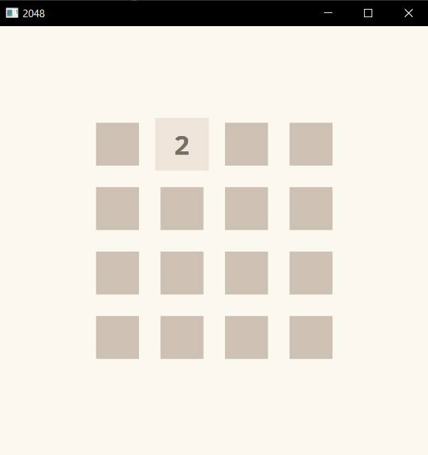

# A Clone from the game 2048

## It's a fully functional game, which implements the basic movement and tile merging

This game was made just for fun, I've written it in rust using the bevy game engine. It has the following features:

* Movement with W, A, S and D or Up, Left, Down and Right
* Merging the tiles together
* Spawning new tiles after each round

## How it looks like

## How to use it

Short explanation.

1. clone this project
2. <a href="https://www.rust-lang.org/" traget="_blank"> install rust from the official site
3. you start it with `cargo run`, after that you can just play with W, A, S or D or the arrow keys

## Found a bug?

If you found a bug while playing the game it would be nice to create an Issue so I can fix it.